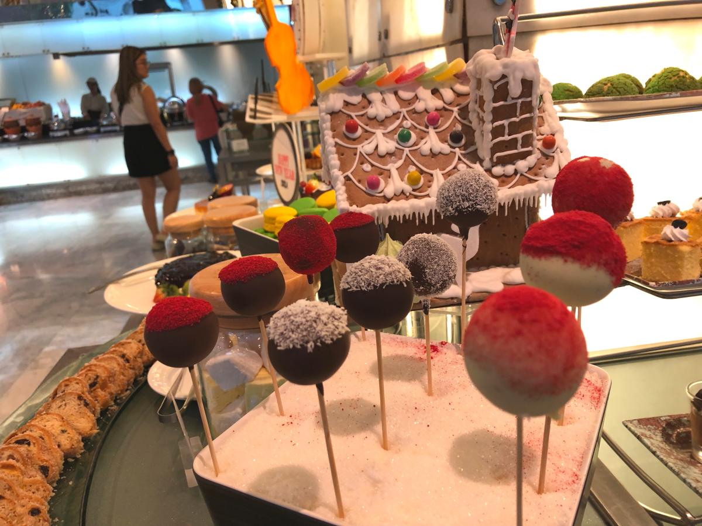
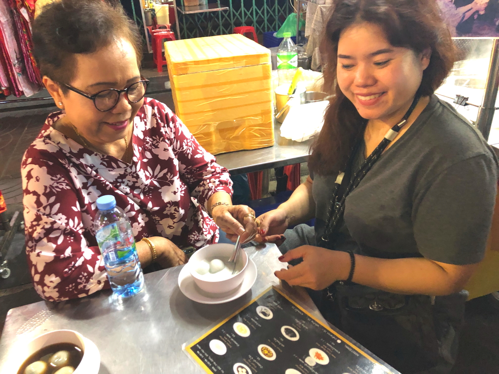

# 2023Dec_Thailand

<html>
<head>

<meta charset="UTF-8">
<meta http-equiv="Content-Type" content="text/html; charset=UTF-8">
<meta http-equiv="X-UA-Compatible" content="IE=EmulateIE10" />
<meta http-equiv="X-UA-Compatible" content="IE=edge">

<!--ここから上はお決まりの定型文です-->

<!--ここからが表現の書式などを決めるcssという部分-->

<link href="https://cdnjs.cloudflare.com/ajax/libs/lightbox2/2.7.1/css/lightbox.css" rel="stylesheet">

</head>

<body>

モバイル端末をお使いの場合は、画面を横向きにすると
より見やすくご覧頂けます。

<!--ここ上は、ほぼそのまま使います！-->

<!--QRコードの挿入例-->

 アクセス用QRコード

<marquee direction="left" scrollamount="20" width="30%">(^_^)/~hada</marquee>

<!--流れ文字の挿入例-->
<h1><marquee behavior="left">!!! 2023/12/28〜2024/01/13 、タイ旅行 !!!</marquee></h1>

Thailand><a href="https://torokoid.github.io/2023Dec_Thailand_2/">Thailand_2></a><a href="https://torokoid.github.io/2023Dec_Thailand_3/">Thailand_3</a>

<!--ここから下が、本体部分-->
 
タイ旅行

  
以下写真集！

  

以下動画集

      

<!--本体はここまで-->

<!--画面に空白地帯を作って、背景が見えるようにしています-->
                                              

<!-- フッタ -->
<footer>
Copyright 2023/12/29 S.Hada
</footer>

<!--HPにさまざまなJavaScriptを呼び込むための書式-->

